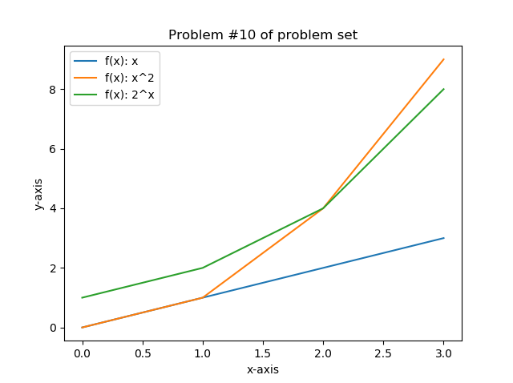

                                 

# Programming &amp; Scripting Problem Set Semester 1 2019

___________________________________________

**Module Name**: Programming & Scripting  
**Module Number**: 52445  
**Student Name**: Yvonne Brady  
**Student ID**: G00376355  
___________________________________________

## 1. Introduction to pands-problem-set 
This repository contains my solutions to the Problem Sets 2019 for the Programming & Scripting module given by _Ian McLoughlin_ of GMIT.

The Problem Set itself is divided into 10 problems and this repository has a separate python program for each problem. See below for details.

## 2. How to download this repository

1. Go to https://github.com/YBrady/pands-problem-set and download the pands-problem-set.
2. Run using python interface such as iPython or any command line interface.
3. Type in "python" (without inverted commas) followed by the name of the file. 
4. For individual instructions on each of the programs see below.

## 3. Summary of Solutions
See the table below for a summary of each of the problems. A more detailed description of each solution is in Section 4 if required.

___________________________________________

| No | Problem Description                                                                                                                                                                                                                                                                               | Program Name  | Comment                                                                              |
|----|-----------------------------------------------------------------------------------------------------------------------------------------------------------------------------------------------------------------------------------------------------------------------------------|---------------|--------------------------------------------------------------------------------------|
| 1  | Input any positive integer the program returns the sum of  all numbers between one and that number.                                                                                                                                                                                               | sumupto.py  | Program will prompt for number                                                       |
| 2  | The program outputs whether or not today is a day that  begins with the letter T.                                                                                                                                                                                                                 | begins-with-t.py  | No need to enter anything.                                                           |
| 3  | This program prints all numbers between 1,000 and 10,000  that are divisible by 6 but not 12.                                                                                                                                                                                                     | divisors.py  | No need to enter anything                                                            |
| 4  | You input any positive integer and the program outputs  the successive values of the following calculation.  At each step calculate the next value by taking the  current value and, if it is even, divide it by two,  but if it is odd, multiply it by three and add one  until the result is 1. | collatz.py  | Enter a value when prompted                                                          |
| 5  | You input a positive integer and the program tells  you if the number is a prime number or not.                                                                                                                                                                                                   | primes.py  | Enter a value when prompted                                                          |
| 6  | You enter a sentence and the program outputs every  second word starting from the first.                                                                                                                                                                                                          | secondstring.py  | Enter a sentence when prompted                                                       |
| 7  | You enter a positive floating point number as input  and the program outputs three versions of the  square root. One using the python math library method,  one using the Newton method and a third using the  Babylonian method of approximating square roots.                                   | squareroot.py  | Enter a value when prompted                                                          |
| 8  | This program outputs today’s date and time in the  format ”Monday, January 10th 2019 at 1:15pm”.                                                                                                                                                                                                  | datetime.py  | No input required                                                                    |
| 9  | This program reads in a text file from an argument  on the command line and outputs every second line.                                                                                                                                                                                            | second.py  | There is a file1.txt file you can enter  as an argument, or pick your own text file. |
| 10 | This program displays a plot of the functions  x, x2 and 2x in the range [0, 4]                                                                                                                                                                                                                   | problem-10.py | No input required                                                                    |

_**Table 1**: Summary of Problems and Solutions_  

## 4. Individual Solutions

### 4.1 Problem 1
The problem posed was:
>Write a program that asks the user to input any positive integer and outputs the sum of all numbers between one and that number.

#### 4.1.1 Problem 1 Solution (sumupto.py)
The user is prompted for an integer. Like all user inputs, python assumes the input is a string which then must be converted to an integer format. If this is not possible, _i.e_ the user inputs a non integer value, an error message is returned to the user.

Once the input is converted, the code goes through a For loop decrementing the original input number by one until it reaches one. During each iteration of the loop the decremented number is added to the running total. At the end of the loop the final sum is printed.

* **To run**: python sumupto.py
* **Prompt**: Please enter a positive integer: 
 * Enter an integer: _e.g._ 23
* **Returns**: _e.g._
 * 276
 * The sum of all numbers from 1 to 23 is 276.

### 4.2 Problem 2
The problem posed was:
>Write a program that outputs whether or not today is a day that begins with the letter T. 

#### 4.2.1 Problem 2 Solution (begins-with-t.py)
First the standard python datetime module is imported. The first letter of the longform text day (%A) is checked. If  it begins with a "T" _i.e_ a Tuesday or Thursday, one message is returned, and another message if the day does not begin with a "T"

* **To run**: python begins-with-t.py
* **Prompt**: None
* **Returns**: 
 * If it is a Tuesday or Thursday: Yes - today begins with a T
 * If it is any other day: No - today does not begin with a T

### 4.3 Problem 3
The problem posed was:
>Write a program that prints all numbers between 1,000 and 10,000 that are divisible by 6 but not 12.

#### 4.3.1 Problem 3 Solution (divisors.py)
Using the range object, the program loops through each number from 1000 to 2000 checking to see what the remainder is when you divide by 6 and the by 12. If the remainder when dividing by 6 is zero (_i.e._ it is divisible by 6) and by 12 is not zero (_i.e._ it is NOT divisible by 12), the number is printed.
* **To run**: python divisors.py
* **Prompt**: None
* **Returns**: 
 * 1002
 * 1014
 * 1026 
 * ...
 * 9978
 * 9990

### 4.4 Problem 4
The problem posed was:
>Write a program that asks the user to input any positive integer and outputs the successive values of the following calculation. At each step calculate the next value by taking the current value and, if it is even, divide it by two, but if it is odd, multiply it by three and add one. Have the program end if the current value is one.

#### 4.4.1 Problem 4 Solution (collatz.py)
The user is first prompted to input a number which is then converted to an integer in the same manner as Problem 1 above. The program then determines whether the number is either even (when the remainder when divided by 2 is zero or false) or odd. If it is even it perfrorms the functions as described in the problem. and similarly if it is odd. The resultant number is concatenated onto the string  and the process repeated until the resultant number is 1. This final 1 is also concatenated onto the result string and this full list of all numbers is finally printed to screen.
* **To run**:   python collatz.py
* **Prompt**: Please enter a positive integer: 
 * Enter an integer: _e.g._ 
 * 13
* **Returns**: _e.g._
 * 13 40 20 10 5 16 8 4 2 1

### 4.5 Problem 5
The problem posed was:
>Write a program that asks the user to input a positive integer and tells the user whether or not the number is a prime.

#### 4.5.1 Problem 5 Solution (primes.py)
The solution starts with asking the user to input a positive integer as before with the concomitant conversion and error checking. 

Once the number is available, the program loops through each number from 2 to the number itself to see if any of the numbers divided evenly into the original number. If no number does it must be a prime. If any number does divide evenly, then the result that the number is not a prime is printed to screen and no further checks are made. 

Special consideration is also given to the numbers 1, which by definition is not a prime number and 2, which is.
* **To run**:   python primes.py
* **Prompt**: Please enter a positive integer: 
 * Enter an integer: _e.g._ 
 * 13
* **Returns**: _e.g._
 * 13 IS a prime number
 * Enter an integer: _e.g._ 
 * 32465653413
* **Returns**: _e.g._
 * 32465653413 is NOT a prime number

### 4.6 Problem 6
The problem posed was:
>Write a program that takes a user input string and outputs every second word.

#### 4.6.1 Problem 6 Solution (secondstring.py)
The user is prompted to input a sentence. This time we do not need to convert it to a number, we do however convert it to an array using the split function.

Every second element of this array is then printed out (starting with the first) and joined with a space separator.
* **To run**:   python secondstring.py
* **Prompt**: Please enter a sentence: 
 * Enter asentence: _e.g._ 
 * I am currently doing a H.Dip. in Data Analytics in GMIT.
* **Returns**: _e.g._
 * I currently a in Analytics GMIT.

### 4.7 Problem 7 (squareroot)
The problem posed was:
>Write a program that that takes a positive floating point number as input and outputs an approximation of its square root.

#### 4.7.1 Problem 7 Solution
As before the user is prompted to enter in a value. This tim eis musy be converted to a floating point value. 

Once conversion is successful I then tried one of three methods for approximating the square root of that number.

The first method I used employed the math.sqrt function directly which I rounded and printed.
The second method involved using the Babylonian method of approximating the square root. This method uses a high guess and a low guess. The algorithm continues until the two guesses are sufficiently close in this case to within 0.1 as this is the extent of approximation that was required for this problem. Each iteration the high guess is reset to be the mid point between both guesses and the low guess is reset as the original number divided by the new High guess. These two guess converge until the square root is approximated. This approximation is rounded and printed. 

Finally, the third method used employed the Newtonian method of approximating square roots as per lecture.

As a side note, the results using each of the three methods were equivalent for all values greater than 1. For values less than one, the math.sqrt function worked best, followed by the Newtonian method, followed by the Babylonian method.

* **To run**:   python squareroot.py
* **Prompt**: Please enter a positive number: 
 * Enter a number: _e.g._ 
 * 5368.2
* **Returns**: _e.g._
 * The python square root of 5368.2 is approx 73.3.
 * The Babylonian square root of 5368.2 is approx 73.3.
 * The Newtonian square root of 5368.2 is approx. 73.3.

### 4.8 Problem 8
The problem posed was:
>Write a program that outputs today’s date and time in the format ”Monday, January 10th 2019 at 1:15pm”.

#### 4.8.1 Problem 8 Solution (datetime.py)
Using the python datetime module, the current date and time is taken. 

Depending on what the date was, the correct ordinal indicator had to be determined _e.g_ "st" for 1, 21 and 31 and the printed string assembled based on this determination. The AM / PM indication by default is uppercase, so this too had to be converted to lowercase.

* **To run**:   python datetime.py
* **Prompt**: None
* **Returns**: _e.g._
 * Wednesday, March 27th 2019 at 07:56pm

### 4.9 Problem 9
The problem posed was:
>Write a program that reads in a text file and outputs every second line. The program should take the filename from an argument on the command line.

#### 4.9.1 Problem 9 Solution (second.py)
Using the python module sys the additional arguments from the command line are read in. Checks are made to ensure only one additional argument other than the command was entered. The is assumed to be the file name.

Checks are then made to ensure this file exists in the current folder. Error messages are returned if any of these checks fails. 

Once the file is available it is opened and each line is read and a line counter is incremented. Using the line counter for reference, every second line is printed starting from the first line _i.e._ 1st, 3rd, 5th lines are printed _etc._.

Special consideration had to be given to the carriage return too to ensure that was also not returned.

For testing purposes a file1.txt file is included in this folder for use. Its contents are as follows:
>This is the first line of my text file.  
This is the second line.  
And the third.  
This is the fourth line.  
Here is the fifth line.  
This is the sixth line.  
Now for the seventh line.  
The eighth line is now.  
This is the second last line / the ninth.  
Finally, the tenth line. The end.

* **To run**: python second.py file1.txt
* **Prompt**: None
* **Returns**: 
 * This is the first line of my text file.
 * And the third.
 * Here is the fifth line.
 * Now for the seventh line.
 * This is the second last line / the ninth.

### 4.10 Problem 10
The problem posed:
>Write a program that displays a plot of the functions x, x2 and 2x in the range [0, 4].
#### 4.10.1 Problem 10 Solution (problem-10.py)
The module mathplotlib.pyplot module was required for this solution.
Here was of the functions as described was designated y1, y2 and y2 respectively. The correct labels and legends were added and included as appropriate along with the plot title too. All three were platted on the same graph.

* **To run**: python problem-10.py
* **Prompt**: None
* **Returns**: 

__________________
